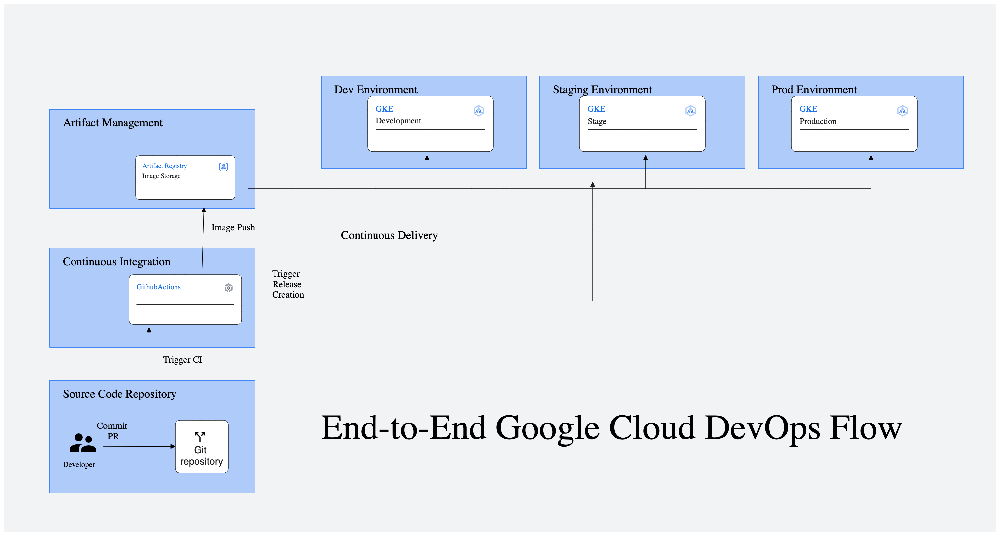

# Web App CI/CD Example

## Architecture Overview

This repository demonstrates a simple Python web app with the source code located in the `/app` directory, Terraform scripts for creating the infrastructure in Google Cloud under `/infrastructure`, the deployment YAML file for the app under the `/deployment` folder, and the app's tests configured under `/tests`.

### Repository Structure

- **/app:** Contains the source code for the Python web app.
- **/infrastructure:** Holds Terraform scripts for creating Google Cloud infrastructure.
- **/deployment:** Contains deployment YAML files.
- **/tests:** Configured tests for the app.

### CI/CD Pipeline

The repository is configured with four GitHub Actions files:

- **pr_check.yaml:** Checks the code and performs unit tests whenever a pull request is raised.
- **deploy.yaml:** Triggered on PR merge to the dev-deploy branch, this file checks the code, performs tests, builds, and deploys the code to Google Artifact Registry. It then deploys the image to the Google Kubernetes Engine (GKE) under the development namespace.
- **staging_deploy.yaml:** Similar to deploy.yaml but deploys to the staging namespace.
- **prod_deploy.yaml:** Similar to deploy.yaml but deploys to the production namespace.


## CI/CD Pipeline Diagram



## Enable Google Cloud APIs

Create a GCP Project and ensure the following APIs are enabled for your Google Cloud project. You can enable them through the Google Cloud Console.

- [Compute Engine API](https://console.cloud.google.com/apis/library/compute.googleapis.com)
- [Kubernetes Engine API](https://console.cloud.google.com/apis/library/container.googleapis.com)

**NOTE:** These APIs are required for `terraform apply` to work on this configuration.

## Create Service Account

1. Create a service account with the `Basic Editor` role. You can do this through the [Google Cloud Console](https://console.cloud.google.com/iam-admin/serviceaccounts).

2. Download the JSON key file for the created service account.

3. Store the JSON key securely and add it as a secret in your GitHub repository. You can do this by going to your GitHub repository's Settings > Secrets and adding a new secret named `SERVICE_ACCOUNT_KEY` with the content of the downloaded JSON key file.

This service account will be used for authentication during the Terraform deployment process.

### GitHub Actions Secrets

Make sure to configure the following GitHub Actions secrets:

- `GCP_PROJECT_ID`
- `GKE_CLUSTER_NAME`
- `GKE_CLUSTER_REGION`
- `GKE_CLUSTER_ZONE`
- `SERVICE_ACCOUNT_KEY`


## Setting up Infrastructure

1. **Clone the Repository:**

    ```bash
    git clone https://github.com/mrsethsamuel/web-ci-cd-example.git
    cd web-ci-cd-example/infrastructure
    ```

2. **Update Variables:**

    Edit `./infrastructure/variables.tf` and update the variables with your desired values.

    ```bash
    nano variables.tf
    ```

3. **Install Google Cloud SDK:**

    Follow the instructions [here](https://cloud.google.com/sdk/docs/install#linux) to install the Google Cloud SDK.

4. **Authenticate with Google Cloud:**

    ```bash
    gcloud auth application-default login
    ```

5. **Initialize Terraform:**

    ```bash
    terraform init
    ```

6. **Apply Terraform Configuration:**

    Apply the Terraform configuration to create the infrastructure.

    ```bash
    terraform apply
    ```

    Follow the prompts to confirm and apply the changes.


## Run the App Locally:

To run the app locally, follow these steps:

```bash
# Example steps to start the app
cd app
python3 -m venv venv
source venv/bin/activate
python3 -m pip install -r requirements.txt
python3 app.py
 ```

View the Running app on http://127.0.0.1:5000 and CTRL + C to stop.


## Resources

- [Terraform Google Kubernetes Engine Module](https://registry.terraform.io/modules/terraform-google-modules/kubernetes-engine/google/latest)

- [HashiCorp Google Provider Documentation](https://registry.terraform.io/providers/hashicorp/google/latest)

- [GitHub Actions Documentation](https://docs.github.com/en/actions)


Enjoy using the web app with integrated CI/CD!